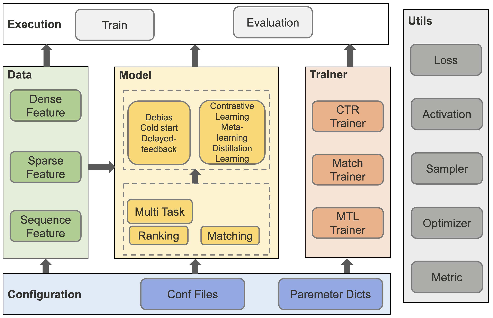

# 项目介绍

## 项目概述

**Torch-RecHub** 是一个使用 PyTorch 构建的、灵活且易于扩展的推荐系统框架。它旨在简化推荐算法的研究和应用，提供常见的模型实现、数据处理工具和评估指标。

## 特性

* **模块化设计:** 易于添加新的模型、数据集和评估指标。
* **基于 PyTorch:** 利用 PyTorch 的动态图和 GPU 加速能力。
* **丰富的模型库:** 包含多种经典和前沿的推荐算法（请在下方列出）。
* **标准化流程:** 提供统一的数据加载、训练和评估流程。
* **易于配置:** 通过配置文件或命令行参数轻松调整实验设置。
* **可复现性:** 旨在确保实验结果的可复现性。
* **易扩展:** 模型训练与模型定义解耦，无basemodel概念。
* **原生函数:** 尽可能使用pytorch原生的类与函数，不做过多定制。
* **模型代码精简:** 在符合论文思想的基础上方便新手学习
* **其他特性:** 例如，支持负采样、多任务学习等。

## 整体架构

## 数据层设计

### 特征类

数值型特征
* 例如年龄、薪资、日点击量等

类别型特征
* 例如城市、学历、性别等
* LabelEncoder编码，得到Embedding向量

序列特征
* 有序兴趣序列：例如最近一周点击过的item list
* 无序标签特征：例如电影类型（动作|悬疑|犯罪）
* LabelEncoder编码，得到序列Embedding向量
* 池化，降维
* 保留序列，与其他特征进行attention等模型操作
* 与Sparse特征共享Embedding Table

### 数据类
* Dataset
* Dataloader

### 工具类
* 序列特征生成
* 样本构造
* 负采样
* 向量化召回

## 模型层设计

### 模型类
通用Layer
浅层特征建模
* LR：逻辑回归
* MLP：多层感知机，可通过字典设置dims等参数
* EmbeddinLayer：通用Embedding层，含三类特征的处理，维护一个dict格式的EmbeddingTable，输出经过模型所需要的输入embedding

深层特征建模
* FM、FFM、CIN
* self-attention、target-attention、transformer

定制Layer